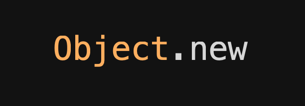

export { default as theme }  from './theme'

import { Appear, Head, Notes } from 'mdx-deck'
import { Split, Horizontal } from 'mdx-deck/layouts'

<Head>
  <title>Sprinkles of FP</title>
</Head>

<h1>
  Sprinkles of Functional Programming
</h1>

---

Hello I'm John,

I work at

---

<ul>
<li>
Github: /johnschoeman
</li>
<li>
Twitter: @john_at_aol_dot_com_at_gmail_dot_com
</li>
</ul>

---

<Split>
<h3>Roadmap</h3>
<ul>
<Appear>
<li style={{width: "150%"}}>Key Thesis</li>
<li style={{width: "150%"}}>A Bit about FP and OO</li>
<li style={{width: "150%"}}>A Recommendation</li>
<li style={{width: "150%"}}>A Story with Some Code</li>
<li style={{width: "150%"}}>Recap / Action Items</li>
<li style={{width: "150%"}}>Questions</li>
</Appear>
</ul>
</Split>

---

<h2>Key Thesis</h2>

---

<h3>Ruby</h3>

is a general purpose language.

<Notes> it is excellent with both object oriented programming and functional progamming
</Notes>

<Notes> the developer gets to choose</Notes>

---

<Horizontal>

</Horizontal>

---

<h3>Different Paradigms</h3>

lend themselves to different tasks.

<Notes>
some times we want to model some real world interactions, create things that
represent a useful thing.

sometime we want take some information from point a to point b, sometimes we
want to ask some quantitative question of some data.

</Notes>

---

<Horizontal>

<h4>OO -> Behaviour</h4>

<h4>FP -> Data</h4>

</Horizontal>

---

<h3>We should choose</h3>

our progamming style based off the task at hand.

Doing so will lead to a better product.

<Notes>
   Some automation tasks lend themselves to an object oriented solution, some to a
   functional solution.
  - Sometimes it makes sense to program ruby in an object oriented way
  - other times it makes sense to program ruby in a functional way.
  - It depends on the task.
  - (you may now leave)
</Notes>

---

If you are modeling behaviour,

perfer classes and composition.

 

If you are handling data,

perfer data pipelines and folds.

---

<h2>A Bit about FP and OO</h2>

---

<h3>Objects and Functions</h3>

are a useful distinction.

<Notes>
explain what you mean by fp
it's not a percise term, it means some different depending on who you're talking
to 
 functions are at the forfront
 avoiding mutation
 avoiding side effects
</Notes>

---

<h3>What is Difficult to Change</h3>

is also a useful distinction.

---

 `-` | Add new method | Add new Data
---|---|---
OO | Existing code unchanged | Existing code changed
FP | Existing code changed | Existing code unchanged

---

<Split>
<h3>OO Typical cases</h3>

<ul>
<Appear>
<li style={{width: "150%"}}>Behaviour modeling</li>
<li style={{width: "150%"}}>Relationship modeling</li>
<li style={{width: "150%"}}>Interation modeling</li>
</Appear>
</ul>

</Split>

---

<Split>
<h3>FP Typical cases</h3>
<ul>
<Appear>
<li style={{width: "150%"}}>Data transformations</li>
<li style={{width: "150%"}}>Data aggregates</li>
<li style={{width: "150%"}}>Data streaming</li>
<li style={{width: "150%"}}>Data templating</li>
</Appear>
</ul>
</Split>

---

<h2>A Recommendation</h2>

---

<h3>Given</h3>

that methods are easy to change in OO

and data are easy to change in FP

---

<h3>Ask</h3>

how you expect requirements

will change before beging a task.

<Notes>
  A good way to decide which task goes to which is by asking what is more
  likely to change in the future of your program, the behaviour, or the data?
  thus given a task you're solving with programming, if you expect behaviour to
  change, prefer object oriented. if you expect data to change, prefer functional programming
</Notes>

---

<h3>Base</h3>

this question off the context of the buisness

and what users might want.

---

<h2>A Story</h2>

with some code

---

<h3>Imagine a Rails App</h3>

<Notes>
explain the app: a generic rails product monolith, there are users, which have
things, and can do things, say a b to b of medium to largish size.

explain the problem: users would like to migrate to the app, they need to upload
their spreadsheets to the app, we need to ingest those spreadsheets, save the
rows for the users as active record objects. They'd like to upload the
spreadsheets to an ftp server and we'll poll it every day to import the files.

Lets call this product...
</Notes>

---

<h3>Inital Requirement</h3>

<Notes>
1. rake task to poll the data - iterate over the files in the ftp server, kick
   off background worker
2. worker: call importer class - iterate over the rows, save to the database
3. success
</Notes>

---

<h3>New Requirement</h3>

---

<ul>
<li>Inital Requirement: Clients Import CSV</li>
<li>and then New Requirement: .xlsx + .csv</li>
<li>and then New Requirement: New Client, New Format</li>
<li>and then New Requirement: Data Validations</li>
</ul>

<Notes>
new requirements from the sales team. they want csv and excel (and they
apparently can't just export excel to csv)
</Notes>

---

<h2>Take Aways</h2>

---

<Split>

<h2>Benefits</h2>

of chosing the right paradigm for the task

<ul>
<Appear>
<li>Less Code</li>
<li>Easier to Test</li>
<li>More Flexible</li>
<li>More Honest</li>
</Appear>
</ul>
</Split>

<Notes>
This is why your life may be better if you choose these approaches
</Notes>

---

<Split>

<h2>Paradigm Smells</h2>

OO when FP might be a better choice

<ul>
<Appear>
<li>divergent changes</li>
<li>shotgun surgery</li>
<li>lots of 'something-er' classes</li>
<li>UDL is a linked list</li>
</Appear>
</ul>
</Split>

---

<h2>Recap / Action Items</h2>

---

<h3>It's Useful</h3>

to consider the what about the task you expect to change

---

<h3>Sprinkles,</h3>

just a little goes a long way

<Notes>
The majority of what we want to do in our Rails apps is concerned with
behaviour, so we would expect that most of our applicaiton code will be classes
and object, thats our models, sevice objects, controllers, but sometimes we have
other task that needs to be done which would lend themselves to a funcitonal
style, but it would be a mistake to try to do everything in a functional style.
</Notes>

---

<h3>Be Conscientious</h3>

of buisness goals before starting work.

<Notes>
It's only helpful to pick one paradigm over the other when we know something is
is likely to change and in what way it will change. If you're not considering
the bigger picture, you're at risk of choosing poorly.
</Notes>

---

<Split>
<h2>Action Items</h2>
<ol>
<Appear>
<li>Understand your task before you choose style</li>
<li>Ask what do you expect will change?</li>
<li>Data or Behaviour?</li>
<li>if Data, consider a functional style</li>
<li>if Behaviour, consider a object oriented style</li>
</Appear>
</ol>
</Split>

---

<h2>Questions</h2>
